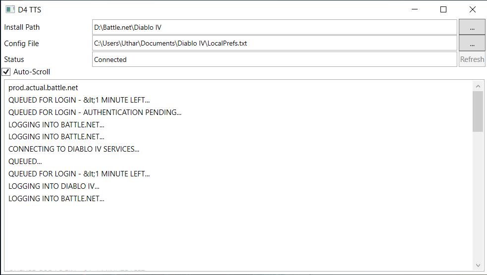
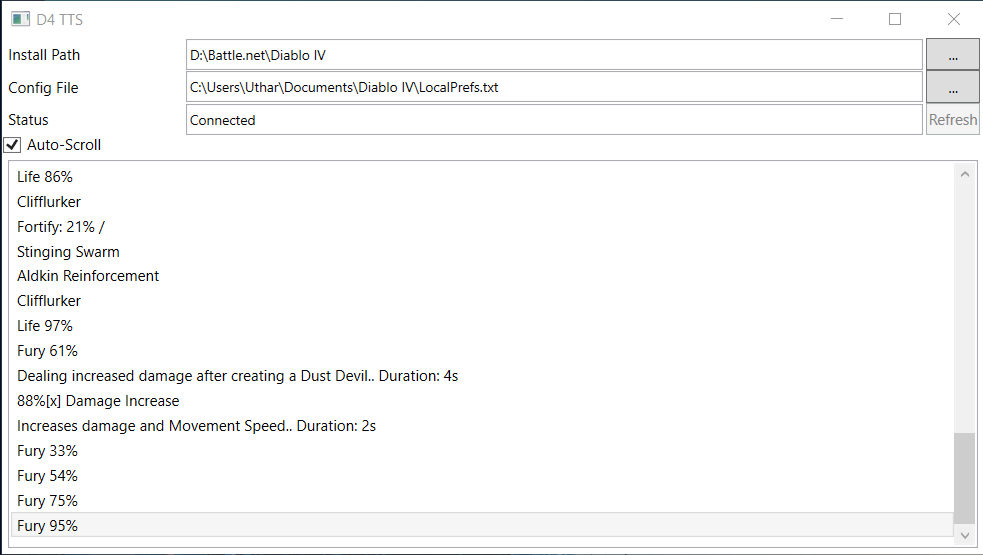

# Diablo IV TTS

D4 TTS is an app to test the TTS (text-to-speech) feature in Diablo IV. Diablo IV uses [Tolk](https://github.com/dkager/tolk/) for thirdparty screenreader support.
Tolk supports multiple screenreaders, D4 TTS uses the System Access API (SAAPI) interface.

## Usage

- Copy the saapi64.dll to your Diablo install folder.
- Open the D4TTS app.
- Set your Install Path.
- Select your config file.
- In Diablo enable the screenreader and support for thirdparty screenreaders.
- Press the Refresh button in the app to check if your configuration is valid.

## Licensing

MIT
